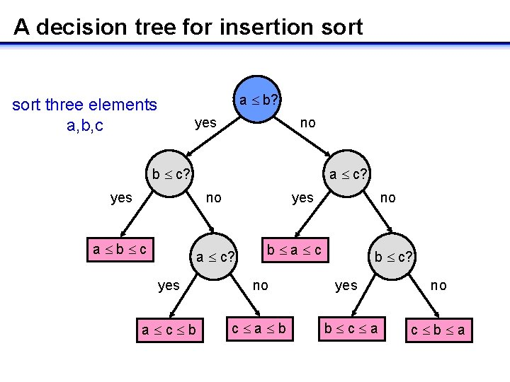

- Selection Sorting 选择排序
    ```java
    public void sort(Comparable[] arr) {
        int n = arr.length;
        for (int i = 0; i < n; i++) {  // 0 -> n, n
            int min = i;
            for (int j = i + 1; j < n; j++) { // n-1 -> 1
                if (Array.less(arr[j], arr[min])) {  // [1] compare
                    min = j;
                }
                if (i != min) {
                    Array.exchange(arr, i, min); // [2] exchange
                }
            }
        }
    }
    ```
    `[1]` 比较 $\sum_{i = n-1}^{1}i = n^2/2$
    `[2]` 交换 $n$
- Insertion Sorting 插入排序
    最坏情况是逆序，最好情况是顺序
    ```java
    public void sort(Comparable[] arr) {
        for (int i = 1; i < arr.length; i++) { // 1 -> n-1
            for (int j = i; j > 0 && Array.less(arr[j], arr[j - 1]); j--) {// [1] compare
                // i -> 0, avg i/2,  max i
                Array.exchange(arr, j - 1, j); // [2] exchange
            }
        }
    }
    ```
    `[1]` 比较 平均 $\sum_{i=1}^{n-1}{i/2} = n^2/4$ ,  最坏情况 $\sum_{i=1}^{n-1}{i} = n^2/2$
    `[2]` 交换 平均 $\sum_{i=1}^{n-1}{i/2} = n^2/4$ ,  最坏情况 $\sum_{i=1}^{n-1}{i} = n^2/2$
- Shell Sorting 希尔排序  
  插入排序只会交换相邻的元素，希尔排序对此进行了改善，交换间隔 `h` 的子序列元素
  选择一个合适的 `h` 序列，如 `1, 4, 13, 40, 121, 364, 1093, ...`, 使用插入排序使数组中任意间隔 `h` 的子数组元素都有序
    ```java
    public void sort(Comparable[] arr) {
        int n = arr.length;
        // 3x + 1 increment sequence: 1, 4, 13, 40, 121, 364, 1093, ...
        // h 序列前面的元素不能是后面元素的因数, 且以1结束（插入排序保证排序有效)
        int h = 1;
        while (h < n / 3) h = 3 * h + 1;
        while (h >= 1) {    //
            // 使用插入排序，保证 h 子数组有序
            for (int i = h; i < n; i++) {   // h -> n-1
                for (int j = i; j >= h && Array.less(arr[j], arr[j - h]); j -= h) {
                    Array.exchange(arr, j, j - h);
                }
            }
            Array.print(arr, "h = " + h);
            h /= 3;
        }
    }
    ```
- Merge Sorting 归并排序
    时间复杂度 $O(N \cdot \log N)$
    需要额外的空间 ( N 长度的数组 )
    ```java
     public void sort(Comparable[] arr) {
        int n = arr.length;
        Comparable[] auxArr = new Comparable[n];
        sort(arr, auxArr, 0, n - 1);
    }

    public void sort(Comparable[] arr, Comparable[] auxArr, int low, int high) {
        if (low >= high) return;
        int mid = (high + low) / 2;
        sort(arr, auxArr, low, mid);
        sort(arr, auxArr, mid + 1, high);
        merge(arr, auxArr, low, mid, high);
    }

    public void merge(Comparable[] arr, Comparable[] auxArr, int low, int mid, int high) {
        if (high + 1 - low >= 0) {
            System.arraycopy(arr, low, auxArr, low, high + 1 - low);
        }
        int i = low, j = mid + 1;
        for (int k = low; k <= high; k++) {
            if (i > mid) arr[k] = auxArr[j++];
            else if (j > high) arr[k] = auxArr[i++];
            else if (Array.less(auxArr[i], auxArr[j])) arr[k] = auxArr[i++];
            else arr[k] = auxArr[j++];
        }
    }
    ```
    分治策略:
    1. devide 分解: 计算mid，$O(1)$
    2. conquer 解决: 递归求解两个 $n/2$ 的子问题, 耗费 $2T(n/2) 时间$
    3. merge 合并: 具有 n 个元素的子数组上合并需要耗费 $O(n) $
        $T(n) = \left\{ 
        \begin{array}{ c l }
            O(1) &\quad n = 1 \\
            2T(n/2) + O(n) &\quad n > 1
        \end{array}
        \right.$
- Merge Bottom Up 自底向上归并排序
  将大问题分割成小问题，然后再合并成规模稍大的问题
  不需要递归
    ```java
   public void sort(Comparable[] arr) {
        int n = arr.length;
        Comparable[] auxArr = new Comparable[n];
        for (int len = 1; len < n; len *= 2) {
            // mid < n - 1
            // i + len -1  < n - 1
            // i + len < n
            for (int i = 0; i + len < n; i += len + len) {
                int high = Math.min(i + 2 * len - 1, n - 1);
                merge(arr, auxArr, i, i + len - 1, high);
            }
        }
    }

    public void merge(Comparable[] arr, Comparable[] auxArr, int l, int m, int h) {
        if (h - l + 1 > 0) {
            System.arraycopy(arr, l, auxArr, l, h - l + 1);
        }
        int i = l, j = m + 1;
        for (int k = l; k <= h; k++) {
            if (i > m) arr[k] = auxArr[j++];
            else if (j > h) arr[k] = auxArr[i++];
            else if (Array.less(auxArr[i], auxArr[j])) arr[k] = auxArr[i++];
            else arr[k] = auxArr[j++];
        }
    }
    ```
- 基于比较的排序算法，最坏情况至少需要 $O(n \log n)$ 次比较才能完成排序
    构建决策树证明：
    
    含 $n$ 个节点的决策树（ 二叉树 ），共有叶子结点 $N!$ 个（ 排列组合个数 ），最坏的情况需要树的高度 $h$ 次比较才能完成排序，二叉树结点数量 $2^h$， 
    $$N!=2^h$$
    $$h=\lg N! \approx N \log N$$
    比较次数最多 $O(N\log N)$, 最坏情况至少需要 $O(n \log n)$ 次比较
- Quick Sort 快速排序
    ```java
    public void sort(Comparable[] arr) {
        Array.shuffle(arr);
        sort(arr, 0, arr.length - 1);
    }

    public void sort(Comparable[] arr, int low, int high) {
        if (high <= low) return;
        if (high - low + 1 <= 8) {
            // [1] use insertion instead
            // Insertion.sort(arr, lo, high);
            // return;
        }
        // [2] int mid = median(low, high, (low + high)/2)
        int mid = partition(arr, low, high); 
        sort(arr, low, mid - 1);
        sort(arr, mid + 1, high);
    }

    // partition the subarray a[low..high] so that a[low..j-1] <= a[j] <= a[j+1..high]
    // and return the index j.
    public int partition(Comparable[] arr, int low, int high) {
        int i = low;
        int j = high + 1;
        Comparable v = arr[low];
        while (true) {
            // find item on lo to swap
            while (Array.less(arr[++i], v)) {
                if (i == high) break;
            }
            // find item on hi to swap
            while (Array.less(v, arr[--j])) {
                if (j == low) break;
            }
            // check if pointers cross
            if (i >= j) break;
            Array.exchange(arr, i, j);
        }
        // put partitioning item v at a[j]
        Array.exchange(arr, low, j);
        // now  a[low...j-1] <= a[j] <= a[j+1...high]
        return j;
    }
    ```
    优化：
    [1] &nbsp; 元素个数较少时插入排序更快
    [2] &nbsp; 取中位数，取更合适的哨兵

